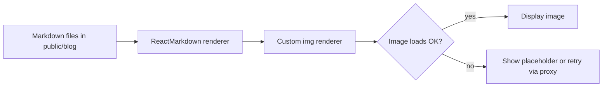

# Blog Section Improvements Plan

Here is the detailed plan to fix broken images and boost SEO for the blog section:

## Steps

1. Error-handling & fallback  
   - Extend the `img` component in `ReactMarkdown` to add an `onError` handler that swaps in a generic placeholder or retries via a CORS-proxy URL.

2. Remote caching  
   - Optionally integrate a 3rd-party image proxy (e.g., Cloudinary) to fetch/external images once, cache them, and serve via a stable CDN URL.

3. Markdown front-matter & metadata  
   - Adopt YAML front-matter in each post (title, description, image) for richer SEO data.

4. SEO meta tags & JSON-LD  
   - Use React Helmet to inject `<title>`, `<meta name="description">`, OpenGraph tags, and structured-data snippets based on front-matter.

5. Sitemap & RSS  
   - Auto-generate `/sitemap.xml` and `/rss.xml` at build time so search engines can discover all posts.

6. Performance & accessibility  
   - Ensure all images have meaningful `alt` text and `loading="lazy"`.  
   - Optionally use responsive `srcSet` or `<picture>` for better performance.

After implementation, test by viewing posts with broken images and verify fallback functionality, then run an SEO audit.