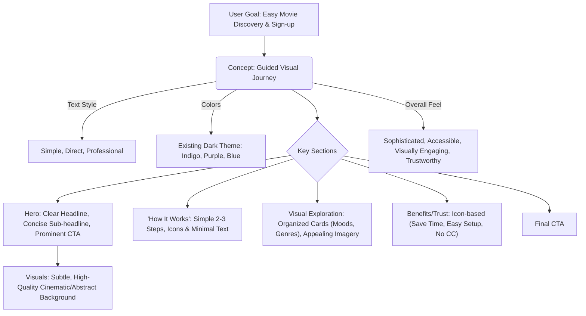

# Landing Page Design Concept: The Guided Visual Journey

**Objective:** Redesign the landing page to be unique, highly engaging, modern, trustworthy, and clearly articulate the website's value, with a primary goal of user sign-ups, targeting casual movie watchers, and emphasizing ease of use.

**Core Principles:**
*   **Text Simplicity:** Clear, direct language, professional yet approachable tone, avoiding excessive punctuation.
*   **Color Consistency:** Adhere to the existing website's dark theme color palette (indigos, purples, blues, and related accents).
*   **Hybrid Approach:** Merges the strengths of visual exploration with friendly guidance.

---

## Concept Details: "The Guided Visual Journey"

*   **Theme:** Effortless and engaging movie discovery, combining intuitive visual browsing with clear, friendly guidance.
*   **Core Message (Example - simple tone):** "Find movies you'll enjoy. Visually explore or let us guide you. Start free."
*   **Visual Style & Mood (Adhering to existing palette):**
    *   **Colors:** Utilize the existing dark theme (indigos, purples, blues from `LandingPage.jsx`) to ensure consistency. Accents can be drawn from the brighter end of this spectrum (e.g., the current indigo-300/400, purple-400) for CTAs and highlights, ensuring they stand out against the darker backgrounds.
    *   **Typography:** Clean, modern, and highly legible sans-serif fonts, ensuring excellent readability on dark backgrounds. Strong hierarchy for clarity.
    *   **Imagery:** High-quality, evocative movie-related visuals (stills, artistic representations of genres/moods), presented in an organized and appealing way. Friendly, clean icons for guidance elements.
    *   **Overall Feel:** Sophisticated yet accessible, visually engaging but also trustworthy and easy to navigate.

*   **Key Structural Elements & Ease of Use:**
    *   **1. Hero Section:**
        *   **Headline:** Clear, concise, focusing on the core benefit (e.g., "Discover Your Next Great Movie, Simply").
        *   **Sub-headline:** Short, explaining the easy visual discovery and guided process.
        *   **Call to Action (CTA):** Prominent, clear (e.g., "Get Started Free" or "Create Your Free Profile").
        *   **Background:** Subtle, high-quality abstract visuals or a very clean, slow-moving cinematic element that doesn't distract.
    *   **2. "How It Works" / "Start Your Journey":**
        *   **Format:** A very simple, visually-driven 2-3 step guide.
        *   **Content Example:** 1. Share Your Taste -> 2. Explore Visually -> 3. Get Matched.
        *   **Visuals:** Use clean icons and minimal text for each step.
    *   **3. Visual Exploration Section:**
        *   **Layout:** Clean, well-organized cards.
        *   **Card Examples:** "Explore by Mood," "Popular Genres," or "Curated For You" (if initial preferences can be hinted at).
        *   **Design:** Each card to use appealing imagery/icons and clear labels.
        *   **Goal:** Make this section feel inviting and effortless for the casual user.
    *   **4. Key Benefits / Trust Builders:**
        *   **Format:** Short, bulleted list or icon-based section.
        *   **Content Examples:** "Save Time," "Personalized For You," "Easy 2-Minute Setup," "No Credit Card Required."
    *   **5. Testimonials (Optional, if concise):**
        *   **Content:** If used, very short (1-2 sentences) quotes from "casual movie watchers" focusing on ease of use and discovery.
    *   **6. Final Call to Action:**
        *   **Purpose:** Reinforce the primary CTA, providing another opportunity for sign-up.

*   **Trust & Engagement Strategy:**
    *   **Trust:**
        *   Consistent design language using the established color palette.
        *   Clear and simple text throughout.
        *   Upfront information (e.g., "No credit card required," "Easy 2-minute setup").
        *   Professional and high-quality imagery.
    *   **Engagement:**
        *   Appealing visual cards for exploration.
        *   Smooth transitions (if animations are used, they should be subtle and purposeful, enhancing usability rather than distracting).
        *   A clear and easy path to user sign-up.

---

## Mermaid Diagram of Concept Structure

---

This document outlines the agreed-upon direction for the new landing page design.