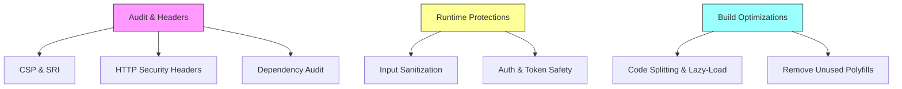

# Security Hardening Plan

## 1. Audit & Headers
- Content-Security-Policy: whitelist self, React assets, Google AdSense; block inline scripts or use nonces.
- Subresource Integrity on external `<script>` (e.g. Ads).
- HTTP headers configured via AWS Amplify / Cloudflare:
  - Strict-Transport-Security
  - X-Frame-Options
  - X-Content-Type-Options
  - Referrer-Policy
  - Permissions-Policy
  - Content-Security-Policy (set via Cloudflare Rules)

## 2. Dependency Audit
- Add `npm audit --audit-level=high` to CI or predeploy.
- Remove unused/browser-only polyfills in webpack fallback (e.g. `fs`, `path`).
- Pin critical deps and review vulnerabilities.

## 3. Runtime Protections
- Input sanitization: leverage React’s auto-escape; for markdown (react-markdown), add `rehype-sanitize`.
- CSP nonces for inline AdSense snippet.
- Ensure Amplify tokens stored only in env, not in client bundle.

## 4. Auth & Token Safety
- Enforce least-privilege in AWS Cognito roles.
- Use secure, HttpOnly cookies for session if applicable.

## 5. Build Optimizations (perf-safe)
- Enable code-splitting for large routes/components (React.lazy + Suspense).
- Tree-shake & remove dev-only code/plugins.
- Defer noncritical scripts (`async`/`defer`).